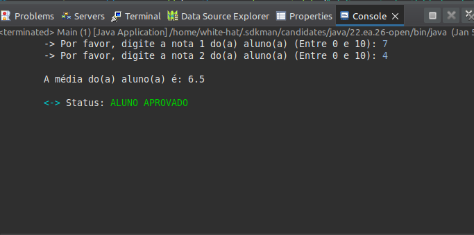

<head>
	<link rel="stylesheet" type="text/css" href="css/style.css" />
</head>

<h1 align="center">Returning to the origins</h1>

## 📖️ About
<p>Here was a simple average calculation program that I made to remember some steps in the Java language and warm up to the Linux environment for creating new projects and remembering some aspects of Java using Eclipse IDE.</p>

<p>I used the JOptionPane lib and tested my memory with java syntax.</p>

<p>In this project I used my mother tongue (Portuguese), but in future projects, I intend to start using English to have greater interaction with whoever will follow the next software.</p>

## 🤝️ Business rules
<p>This project is used to calculate a student's final average and return the status (passed or failed) according to the grades. To carry out this return, the final average equal to or less than 5 is considered as a failing grade, and between 6 and 10, it is presented as an passing grade. The system only accepts grades with values ​​between 0 and 10. After entering grades 1 and 2, if the average between these 2 values ​​is below 6, you will be asked to enter grade 3 to replace the lowest grade and calculate a new average.</p>


<br/>
<p align="center" class="italic">Practical examples below</p>
<hr/>

<h3 align="center" class="green-title">First part of program interaction</h3>


<br/>

<h3 align="center" class="green-title">Second part of program interaction</h3>


<br/>
<hr/>

## 🔨 Tools

- [OS - Linux Mint](https://www.linuxmint.com/download.php)
- [Java 22.ea.26-open across sdkman](https://sdkman.io/install)
- [Eclipse](https://eclipseide.org/)

<br />
<hr />

## 📚 Libs
- java.util.Scanner;
- javax.swing.JOptionPane.

```bash
	#Clone this project
    git clone https://github.com/giovanni0800/java-calculator.git
```

## 📔️ License
This Project is under the MIT license. See the file LICENSE
for more details